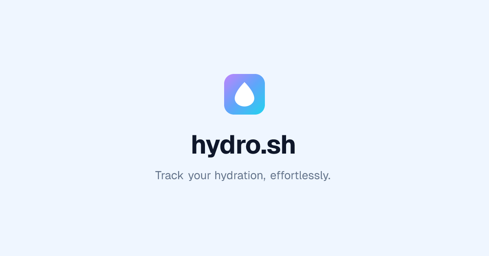

# hydro.sh 💧

A clean, fast web app for smart water bottle tracking - without the bloat.



## Features

✅ **Bluetooth Sync** - Connect directly to smart water bottles (HidrateSpark supported)  
✅ **Browser-Based** - No app downloads, works on any device  
✅ **Multi-Bottle Support** - Track multiple bottles seamlessly  
✅ **Free LED Control** - Change your bottle's LED colors without premium  
✅ **Manual Logging** - Track intake even without a smart bottle  
✅ **Privacy First** - Your data stays local, not locked in corporate servers  
✅ **No Social Bloat** - Just hydration tracking, no leaderboards or friend requests


This project was created with [Better-T-Stack](https://github.com/AmanVarshney01/create-better-t-stack), a modern TypeScript stack that combines React, TanStack Start, Hono, ORPC, and more.

## Features

- **TypeScript** - For type safety and improved developer experience
- **TanStack Start** - SSR framework with TanStack Router
- **TailwindCSS** - Utility-first CSS for rapid UI development
- **shadcn/ui** - Reusable UI components
- **Hono** - Lightweight, performant server framework
- **oRPC** - End-to-end type-safe APIs with OpenAPI integration
- **Bun** - Runtime environment
- **Drizzle** - TypeScript-first ORM
- **PostgreSQL** - Database engine
- **Authentication** - Email & password authentication with Better Auth
- **Turborepo** - Optimized monorepo build system

## Getting Started

First, install the dependencies:

```bash
bun install
```
## Database Setup

This project uses PostgreSQL with Drizzle ORM.

1. Make sure you have a PostgreSQL database set up.
2. Update your `apps/server/.env` file with your PostgreSQL connection details.

3. Apply the schema to your database:
```bash
bun db:push
```


Then, run the development server:

```bash
bun dev
```

Open [http://localhost:3000](http://localhost:3000) in your browser to see the web application.

The API is running at [http://localhost:3001](http://localhost:3001).


## Project Structure

```
hydro.sh/
├── apps/
│   ├── web/         # Frontend application (React + TanStack Start)
│   └── server/      # Backend API (Hono, ORPC)
```

## Available Scripts

- `bun dev`: Start all applications in development mode
- `bun build`: Build all applications
- `bun dev:web`: Start only the web application
- `bun dev:server`: Start only the server
- `bun typecheck`: Check TypeScript types across all apps
- `bun db:push`: Push schema changes to database
- `bun db:studio`: Open database studio UI
